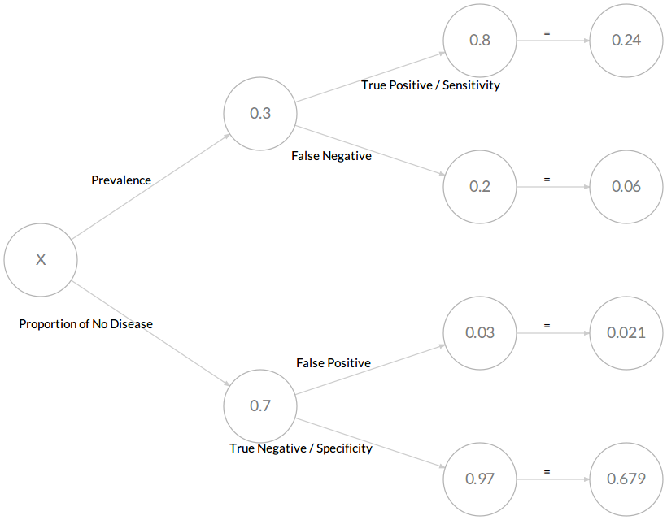

```{r setup, include = FALSE}
knitr::opts_chunk$set(echo = TRUE, dev="cairo_pdf")
```

```{r libraries, include = FALSE}
library(tidyverse)
library(knitr)
library(sysfonts)
library(kableExtra)
library(DiagrammeR)               # For probability trees
library(DiagrammeRsvg)
library(magrittr)
library(rsvg)
windowsFonts("Lato" = windowsFont("Lato"))
```

**INSTRUCTIONS**

The data set that we will be using for the entire course is resampled data from the MIT COVID-19 Beliefs, Behaviors & Norms Survey (https://covidsurvey.mit.edu/api.html). This is a multi-country, online survey that examined different COVID-19 perceptions across time, from July 6, 2020 to March 28, 2021. We will be using data from the Philippines aged 20 to 60.

In this lab, you will practice calculating probabilities given aggregate statistics from this data set.

You have many options to submit this worksheet. Either you work on this by hand and scan/take a clear photo of your submission and save as PDF, or type your responses in a Word processor or PowerPoint presentation. You do not have to copy the questions again, but please number them accordingly.

```{r read_data, include = FALSE}
data <- read.csv("C:/Users/neljasonhaw/Google Drive (nhaw@ateneo.edu)/HSCI 50 SY 2021-2022/Labs/vax_accept_dummydata.csv")
```

&nbsp;

**Part A. The following table summarizes the responses of vaccine acceptance by age group in the Philippines during the survey's final wave, conducted last March 14 to 28, 2021. Answer the questions that follow. Express your answers as fractions. You may use a calculator.**

```{r table1, echo = FALSE, message = FALSE}
data$response <- factor(data$response, 
                        levels = c("Yes",  "No", "Don't Know", "Vaccinated"))
table1 <- data %>% filter(wave == 19) %>% group_by(age_grp, response) %>% summarize(n=n()) %>% spread(age_grp, n)
colnames(table1) <- c("Accept COVID-19 vaccine", "Aged 20-30", "Aged 31-40", "Aged 41-50", "Aged 51-60")
kable(table1, booktab = "T", caption = "COVID-19 vaccine acceptance across age groups in the Philippines, March 14-18, 2021") %>%
  kable_styling(latex_options = "hold_position")
```

**1. The total sample size for this survey is 1,145 respondents. If a person is chosen at random from this pool of respondents, what is the probability that:**

a. This person has already been vaccinated
b. This person has not been vaccinated
c. This person is not 51-60 years old
d. This person does not accept the COVID-19 vaccine **or** is 20-30 years old
e. This person accepts the COVID-19 vaccine **or** has already been vaccinated
f. This person accepts the COVID-19 vaccine **and** has already been vaccinated
g. This person accepts the COVID-19 vaccine **and** is 31-40 years old
h. This person accepts the COVID-19 vaccine **given** they are 31-40 years old
i. This person does not accept the COVID-19 vaccine or is unsure about it **given** they are 41-50 years old
j. This person accepts the COVID-19 vaccine or has already been vaccinated **given** they are 40 years old and below.


The answers are as follows:

a. This person has already been vaccinated

$$ \frac{\mathrm{Vaccinated}}{\mathrm{Total}} = \frac{18 + 5 + 10 + 1}{1145}= \frac{34}{1145}$$

&nbsp;

b. This person has not been vaccinated

This is simply the complement of (a), or you can add the other three categories (more work, though)
$$ \frac{\mathrm{Not \ been \ vaccinated}}{\mathrm{Total}} = 1 - \frac{18 + 5 + 10 + 1}{1145} = 1 - \frac{34}{1145} = \frac{1111}{1145}$$

&nbsp;


c. This person is not 51-60 years old

This is the complement of the probability those who are not 51-60 years old
$$ \frac{\mathrm{Not \ 51-60 \ years \ old}}{\mathrm{Total}} = 1 - \frac{110 + 26 + 32 + 1}{1145} = 1 - \frac{169}{1145} = \frac{976}{1145}$$

&nbsp;

d. This person does not accept the COVID-19 vaccine **or** is 20-30 years old

Remember the rejoinder OR means that we count both categories and subtract it with whatever overlaps between them (what is indicated by the rejoinder AND) so that we do not count the overlaps twice. In this case, we add all those who do not accept the COVID-19 vaccine, then add those 20-30 years old, and make sure that we count those who do not accept the COVID-19 vaccine AND 20-30 years old only once. $P(A \ \mathrm{or} \ B) = P(A) + P(B) - P(A \ \mathrm{and} \ B)$

$$ \frac{\mathrm{Do \ not \ accept \ vaccine \ OR \ 20-30 \ years \ old}}{\mathrm{Total}} = \frac{(83 + 63 + 39 + 26) + (179 + 83 + 157 + 18) - 83}{1145}= \frac{565}{1145}$$

&nbsp;

e. This person accepts the COVID-19 vaccine **or** has already been vaccinated

In this case, the rejoinder OR is counting two disjoint (mutually exclusive) events, so there are no overlaps, i.e. $P (A \ \mathrm{and} \ B) = 0$

$$ \frac{\mathrm{Accepts \ vaccine \ OR \ Vaccinated}}{\mathrm{Total}} = \frac{(179 + 166 + 123 + 110) + (18 + 5 + 10 + 1)}{1145}= \frac{612}{1145}$$

&nbsp;

f. This person accepts the COVID-19 vaccine **and** has already been vaccinated

In this case, the rejoinder AND is counting two disjoint (mutually exclusive) events, as we have established in (e). Therefore, the answer is 0.

&nbsp;

g. This person accepts the COVID-19 vaccine **and** is 31-40 years old

$$ \frac{\mathrm{Accepts \ vaccine \ AND \ 31-40 \ years \ old}}{\mathrm{Total}} = \frac{166}{1145}$$

&nbsp;

h. This person accepts the COVID-19 vaccine **given** they are 31-40 years old

Now we are measuring conditional probabilities (as indicated by the rejoinder GIVEN). Our denominator is not the total sample anymore, but whatever is the conditional statement.
$$ \frac{\mathrm{Accepts \ vaccine \ among \ 31-40 \ years \ old}}{\mathrm{31-40 \ years \ old}} = \frac{166}{166 + 63 + 89 + 5} = \frac{166}{323}$$

&nbsp;

i. This person does not accept the COVID-19 vaccine or is unsure about it **given** they are 41-50 years old

Take note that the numerator has the rejoinder OR, but these are disjoint events so there are no overlaps.

$$ \frac{\mathrm{Does \ not \ vaccine \ OR \ Unsure \ among \ 41-50 \ years \ old}}{\mathrm{41-50 \ years \ old}} = \frac{39 + 44}{123 + 39 + 44 + 10} = \frac{83}{216}$$

&nbsp;

j. This person accepts the COVID-19 vaccine or has already been vaccinated **given** they are 40 years old and below

Take note that the denominator covers those who are below 40 years old. In other words, 20-30 years old OR 31-40 years old

$$ \frac{\mathrm{Accepts \ vaccine \ OR \ Vaccinated \ among \ 40 \ years \ old \ and \ below}}{\mathrm{40 \ years \ old \ and \ below}} = \frac{(179 + 18) + (166 + 5)}{(179 + 83 + 157 + 18) + (166 + 63 + 89 + 5)} = \frac{368}{760}$$

&nbsp;

**2. Let's define vaccine hesitancy as not accepting or being unsure about the COVID-19 vaccine. Based on this definition, does our data show that vaccine hesitancy and age are independent? Why or why not? If it is not independent, what direction is the relationship trending towards? Hint: calculate conditional probabilities of vaccine hesitancy per age group and express your answers as percentages.**

First, we check the conditional probabilities of vaccine hesitancy across age groups. The basic formula is
$$\frac{\mathrm{Vaccine \ hesitancy \ among \ age \ group}}{\mathrm{Total \ age \ group}}$$

The conditional probabilities of each age group are as follows:

* 20-30 years old: $\frac{83 + 157}{179 + 83 + 157 + 18} = 0.55$
* 31-40 years old: $\frac{63 + 89}{166 + 63 + 89 + 5} = 0.47$
* 41-50 years old: $\frac{39 + 44}{123 + 39 + 44 + 10} = 0.38$
* 51-60 years old: $\frac{26 + 32}{110 + 26 + 32 + 1} = 0.34$

Statistical independence is established when the occurence of one event does not affect the occurence of another. In our example, we would see statistical independence if the conditional probability of vaccine hesitancy for each age group were not different from one another. We can clearly see that the probabilities vary widely across age groups. Therefore, the relationship is not independent. The trend is that younger age groups are more vaccine hesitant than older age groups. From a public health perspective, we should be concerned about vaccine hesitancy across all age groups, as around 2 in 5 are vaccine hesitant, but more so among younger people.

&nbsp;

**PART B. Read the following problem below and construct a probability tree, a 2x2 table, or use Bayes' Theorem to answer the question.**

**Now consider the Philippine government's testing policy for COVID-19. The government said that in the context of a widespread outbreak and the declaration of a strict lockdown, a rapid antigen test validated against World Health Organization (WHO) standards may be used as a confirmatory COVID-19 test instead of the gold standard reverse transcriptase - polymerase chain reaction (RT-PCR) test.**

**At the minimum, a validated rapid antigen test has 80% sensitivity, or the probability of receiving a positive test result given having the disease, and 97% specificity, or the probability of receiving a negative test result given not having the disease. Assume that the true prevalence of COVID-19 in a widespread outbreak is 30%. What is the positive predictive value, or the probability of having the disease given a positive test result? Round off your answer to the nearest percent.**

&nbsp;

The question has three givens:

$$Pr(\mathrm{Antigen \ + \ | \ COVID}) = 0.80$$
$$Pr(\mathrm{Antigen \ - \ | \ No COVID}) = 0.97$$
$$Pr(\mathrm{COVID}) = 0.30$$

Method 1: 2x2 tables

Assume 1000 people in the entire sample. With a prevalence of 30%, 300 people have COVID, 700 people don't.

```{r table2x21, echo = FALSE}
table221 <- as.data.frame(c("Antigen +", "Antigen -", "Total"))
table221$covid <- c("", "", "300")
table221$noncovid <- c("", "", "700")
table221$total <- c("", "", "1000")
colnames(table221) <- c("", "COVID", "No COVID", "Total")

kable(table221, booktab = "T")
```

&nbsp;

Given that the sensitivity is 80%, the number of true positives is 0.80 * 300 = 240 and false negatives is 0.20 * 300 = 60
```{r table2x22, echo = FALSE}
table222 <- as.data.frame(c("Antigen +", "Antigen -", "Total"))
table222$covid <- c("240", "60", "300")
table222$noncovid <- c("", "", "700")
table222$total <- c("", "", "1000")
colnames(table222) <- c("", "COVID", "No COVID", "Total")

kable(table222, booktab = "T")
```

&nbsp;

Given that the specificity is 97%, the number of true negatives is 0.97 * 700 = 679 and false positives is 0.03 * 700 = 21. We also fill in the rest of the totals
```{r table2x23, echo = FALSE}
table223 <- as.data.frame(c("Antigen +", "Antigen -", "Total"))
table223$covid <- c("240", "60", "300")
table223$noncovid <- c("21", "679", "700")
table223$total <- c("251", "739", "1000")
colnames(table223) <- c("", "COVID", "No COVID", "Total")

kable(table223, booktab = "T")
```

From the table, we can calculate the positive predictive value as $\frac{240}{251} = 92 \%$

&nbsp;

Method 2: Probability Tree
```{r probtree, include = FALSE}
# Code copied from https://daranzolin.github.io/2018-01-07-probability-trees/
par(family = "Lato")
bayes_probability_tree <- function(prior, true_positive, true_negative) {
  
  if (!all(c(prior, true_positive, true_negative) > 0) && !all(c(prior, true_positive, true_negative) < 1)) {
    stop("probabilities must be greater than 0 and less than 1.",
         call. = FALSE)
  }
  c_prior <- 1 - prior
  c_tp <- 1 - true_positive
  c_tn <- 1 - true_negative
  
  round4 <- purrr::partial(round, digits = 4)
  
  b1 <- round4(prior * true_positive)
  b2 <- round4(prior * c_tp)
  b3 <- round4(c_prior * c_tn)
  b4 <- round4(c_prior * true_negative)
  
  bp <-  round4(b1/(b1 + b3))
  
  labs <- c("X", prior, c_prior, true_positive, c_tp, true_negative, c_tn, b1, b2, b4, b3)
  
  tree <-
    create_graph() %>%
    add_n_nodes(
      n = 11,
      type = "path",
      label = labs,
      node_aes = node_aes(
        shape = "circle",
        fontname = "Lato",
        fontsize = 15,
        fillcolor = "white",
        height = 1,
        width = 1,
        x = c(0, 3, 3, 6, 6, 6, 6, 8, 8, 8, 8),
        y = c(0, 2, -2, 3, 1, -3, -1, 3, 1, -3, -1))) %>% 
    add_edge(
      from = 1,
      to = 2,
      edge_aes = edge_aes(
        label = "Prevalence",
        fontname = "Lato",
        fontsize = 12
      )
    ) %>% 
    add_edge(
      from = 1, 
      to = 3,
      edge_aes = edge_aes(
        label = "Proportion of No Disease",
        fontname = "Lato",
        fontsize = 12
      )
    ) %>% 
    add_edge(
      from = 2,
      to = 4,
      edge_aes = edge_aes(
        label = "True Positive / Sensitivity",
        fontname = "Lato",
        fontsize = 12
      )
    ) %>% 
    add_edge(
      from = 2,
      to = 5,
      edge_aes = edge_aes(
        label = "False Negative",
        fontname = "Lato",
        fontsize = 12
      )
    ) %>% 
    add_edge(
      from = 3,
      to = 7,
      edge_aes = edge_aes(
        label = "False Positive",
        fontname = "Lato",
        fontsize = 12
      )
    ) %>% 
    add_edge(
      from = 3,
      to = 6,
      edge_aes = edge_aes(
        label = "True Negative / Specificity",
        fontname = "Lato",
        fontsize = 12
      )
    ) %>% 
    add_edge(
      from = 4,
      to = 8,
      edge_aes = edge_aes(
        label = "=",
        fontname = "Lato",
        fontsize = 12
      )
    ) %>% 
    add_edge(
      from = 5,
      to = 9,
      edge_aes = edge_aes(
        label = "=",
        fontname = "Lato",
        fontsize = 12
      )
    ) %>% 
    add_edge(
      from = 7,
      to = 11,
      edge_aes = edge_aes(
        label = "=",
        fontname = "Lato",
        fontsize = 12
      )
    ) %>% 
    add_edge(
      from = 6,
      to = 10,
      edge_aes = edge_aes(
        label = "=",
        fontname = "Lato",
        fontsize = 12
      )
    ) 
  message(glue::glue("The probability of having the disease after testing positive is {bp}"))
  print(render_graph(tree))
  export_graph(tree, file_name = "pic1.png", file_type = "png")
  invisible(tree)
}
bayes_probability_tree(prior = 0.30, true_positive = 0.80, true_negative = 0.97)
```

{width=70%}

Based on the figure above, the positive predictive value is $\frac{0.24}{0.24 + 0.021} = 92 \%$

&nbsp;


Method 3: Bayes' Theorem

\begin{equation*} 
\begin{aligned}
Pr(\mathrm{COVID \ | \ Antigen \ + \ }) &= \frac{Pr(\mathrm{Antigen \ + \ | \ COVID}) \times Pr(\mathrm{COVID})} {Pr(\mathrm{Antigen \ + \ | \ COVID}) \times Pr(\mathrm{COVID}) \ + \ Pr(\mathrm{Antigen \ + \ | \ No \ COVID}) \times Pr(\mathrm{No \ COVID})} \\ 
&= \frac{0.8 \times 0.3}{(0.8 \times 0.3) + (0.03 \times 0.7)}  \\ 
&= 92 \% 
\end{aligned}
\end{equation*}


**Public health implication**

The government seemed to have made a fairly reasonable policy decision in allowing the use of rapid antigen testing kits in areas with widespread community infection. A positive predictive value of 92% seems acceptable given that rapid antigen test results can give results as quickly as 15 minutes as compared to the gold standard RT-PCR test which may take hours to days. The government may not admit that 30% of the population at any given time (that's almost 1 out of 3!) has COVID-19, that is a reasonable assumption to make given data from other countries through studies that we call seroprevalence studies. Seroprevalence studies measure antibody levels in a random sample of a population, and many countries like India and Spain do these seroprevalence studies regularly for the entire population to get a sense of how prevalent COVID-19 was around two to three months prior to the conduct of the seroprevalence study. There were estimates in India last year that seroprevalence reached as high as 70%, which made the government there think that the country had reached natural herd immunity. We now know of course that the new variants of concern, such as the Delta variant, has the capacity to reinfect previously infected persons. 

&nbsp;

&nbsp;

\center END OF LAB \center


