```{r setup, include = FALSE}
knitr::opts_chunk$set(echo = TRUE, dev="cairo_pdf")
```

```{r libraries, include = FALSE}
library(tidyverse)
library(knitr)
library(sysfonts)
library(kableExtra)
windowsFonts("Lato" = windowsFont("Lato"))
```

**INSTRUCTIONS**

The data set that we will be using for the entire course is resampled data from the MIT COVID-19 Beliefs, Behaviors & Norms Survey (https://covidsurvey.mit.edu/api.html). This is a multi-country, online survey that examined different COVID-19 perceptions across time, from July 6, 2020 to March 28, 2021. We will be using data from the Philippines aged 20 to 60.

In this lab, you will practice calculating probabilities given a binomial distribution and a normal distribution.

You have many options to submit this worksheet. Either you work on this by hand and scan/take a clear photo of your submission and save as PDF, or type your responses in a Word processor or PowerPoint presentation. You do not have to copy the questions again, but please number them accordingly.

```{r read_data, include = FALSE}
data <- read.csv("C:/Users/neljasonhaw/Google Drive (nhaw@ateneo.edu)/HSCI 50 SY 2021-2022/Labs/vax_accept_dummydata.csv")
```

&nbsp;

&nbsp;

**Part A. Binomial Distribution.**

We will revisit the table from Lab 2 and recode the vaccine acceptance categories into a new variable, vaccine hesitancy. Those who do not accept the vaccine or are unsure about it will be considered vaccine hesitant, otherwise they are not vaccine hesitant. The table below summarizes that information.


```{r table1, echo = FALSE, message = FALSE}
data <- data %>% mutate(hesitant = case_when(response == "Yes" | response == "Vaccinated" ~ "No",
                                             response == "No" | response == "Don't Know" ~ "Yes"))
table1 <- data %>% filter(wave == 19) %>% group_by(hesitant) %>% summarize(n=n(), p=round(n()/1145,3)*100)
colnames(table1) <- c("Vaccine hesitant", "Count", "Percent")
kable(table1, booktab = "T", caption = "COVID-19 vaccine hesitancy in the Philippines, March 14-28, 2021") %>%
  kable_styling(latex_options = "hold_position")
```

**1. Why was dichotomizing the vaccine acceptance outcome necessary to calculate probabilities based on the binomial distribution?**

Because one of the assumptions required for binomial distribution is that the outcome is binary.

&nbsp;

**2. One of the other assumptions of the binomial distribution is that the outcomes are independent from one another. This assumption cannot be tested empirically (meaning, with whatever data you have). In the simplest of explanations, what does this mean in the context of this data?**

The responses of individuals to the vaccine hesitancy question is not influenced in any way by any other individual responding.

&nbsp;

**3. Another assumption of the binomial distribution is that the probabilities of the outcomes of the trials remain the same across trials. In the context of this data, what does that mean exactly?**

We assume that for the probability that a person is vaccine hesitant is the same across individuals randomly selected, and that the probability is 0.466.

&nbsp;

**For questions 4-8, calculate this question by hand (you may use a calculator), and show your solutions. Approximate your answers to the nearest thousandth. Whenever appropriate, you may use the University of Iowa Binomial Distribution Applet [(https://homepage.divms.uiowa.edu/~mbognar/applets/bin.html)](https://homepage.divms.uiowa.edu/~mbognar/applets/bin.html). Assume that three persons are randomly selected from this sample.**

**4. What is the probability that only the first person selected will be vaccine hesitant?**

\begin{equation*} 
\begin{aligned}
P(\mathrm{only \ 1st \ person \ hesitant}) &= P(\mathrm{1st \ person \ hesitant}) \times P(\mathrm{2nd \ person \ not \ hesitant}) \times P(\mathrm{3rd \ person \ not \ hesitant}) \\
&= 0.466 \times 0.534 \times 0.534 \\
&= 0.133
\end{aligned}
\end{equation*}

&nbsp;

**5. What is the probability that only one person selected will be vaccine hesitant?**

We have to consider three independent events: that the first person selected is the only one hesitant, that the second person selected is the only one hesitant, and that the third person selected is the only hesitant. We have already caclulated the probability of the first event from Question 4, and this is also the same probability for the other two events because we assume that the probability of the outcome is the same for all individuals.

Using the addition rule:

\begin{equation*} 
\begin{aligned}
P(\mathrm{only \ one \ person \ hesitant}) &= P(\mathrm{only \ 1st \ person \ hesitant}) + P(\mathrm{only \ 2nd \ person \ hesitant}) + P(\mathrm{only \ 3rd \ person \ hesitant}) \\
&= 0.133 + 0.133 + 0.133 \\
&= 0.399
\end{aligned}
\end{equation*}

&nbsp;

You may also solve this probability using the binomial distribution
$$P(X = x) = {n \choose x}p^xq^{n-x}$$
The given values are: $x$ = 1, $n$ = 3, $p$ = 0.466, $q = 1 - p$ = 0.534

$$P(X = 1) = {3 \choose 1}(0.466)^1(0.534)^2 = 0.399$$

&nbsp;

You may also use the applet and should get the same result:

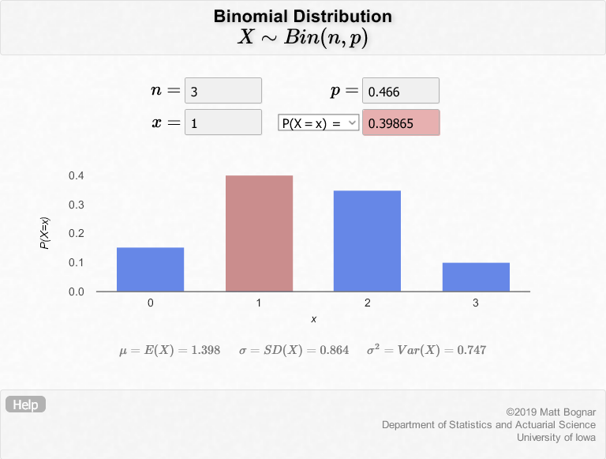{width=85%}

&nbsp;


**6. What is the probability that the first two persons selected will be vaccine hesitant?**

Your solution should be very similar to Question 4.

\begin{equation*} 
\begin{aligned}
P(\mathrm{only \ first \ two \ persons \ hesitant}) &= P(\mathrm{1st \ person \ hesitant}) \times P(\mathrm{2nd \ person \ hesitant}) \times P(\mathrm{3rd \ person \ not \ hesitant}) \\
&= 0.466 \times 0.466 \times 0.534 \\
&= 0.116
\end{aligned}
\end{equation*}

&nbsp;

**7. What is the probability that the exactly two persons selected will be vaccine hesitant?**

Your solution should be very similar to Question 5.

Using the addition rule:

\begin{equation*} 
\begin{aligned}
P(\mathrm{only \ two \ hesitant}) &= P(\mathrm{1st \ and \ 2nd \ hesitant}) + P(\mathrm{1st \ and \ 3rd \ hesitant}) + P(\mathrm{2nd \ and \ 3rd \ hesitant}) \\
&= 0.116 + 0.116 + 0.116 \\
&= 0.348
\end{aligned}
\end{equation*}

&nbsp;

Using the binomial distribution formula, the given values are: $x$ = 2, $n$ = 3, $p$ = 0.466, $q$ = 0.534

$$P(X = 2) = {3 \choose 2}(0.466)^2(0.534)^1 = 0.348$$

&nbsp;

You may also use the applet and should get the same result:

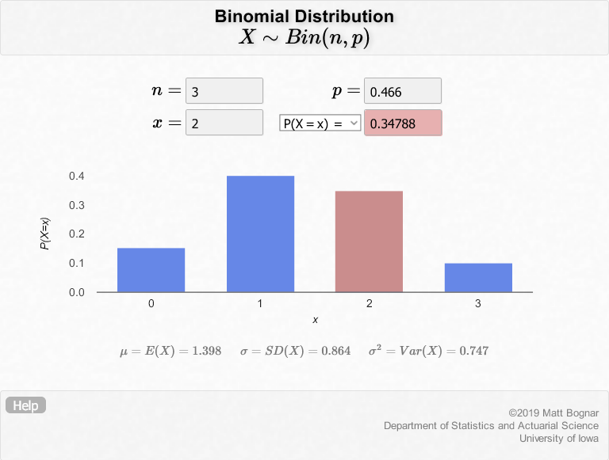{width=85%}

&nbsp;


**8. Using what you have calculated so far, and calculating some more, complete the following table:**

```{r table2, echo = FALSE}
table2 <- as.data.frame(c(0, 1, 2, 3))
table2$prob <- c("", "", "", "")
colnames(table2) <- c("Number of vaccine hesitant (x)", "P(X = x) = Probability of x vaccine hesitant")
kable(table2, booktabs = "T") %>% kable_styling(latex_options = "hold_position")
```

Question 5 gave us $P(X = 1)$, while Question 7 gave us $P(X = 2)$. We can use either the formula or the applet to calculate $P(X = 0)$ and $P(X = 3)$. The applet is much easier to use, so let us plug in the values there.

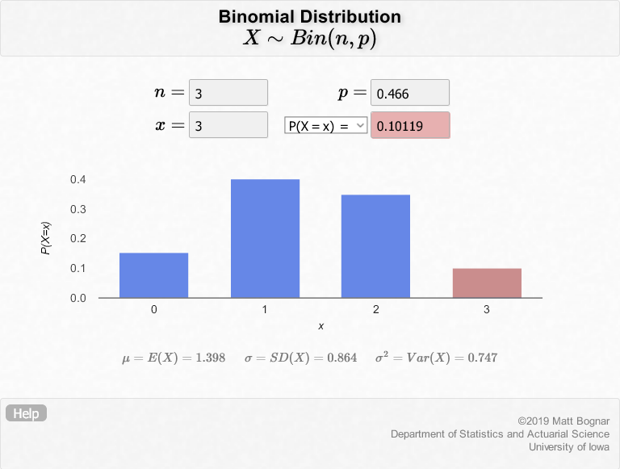{width=85%}

&nbsp;

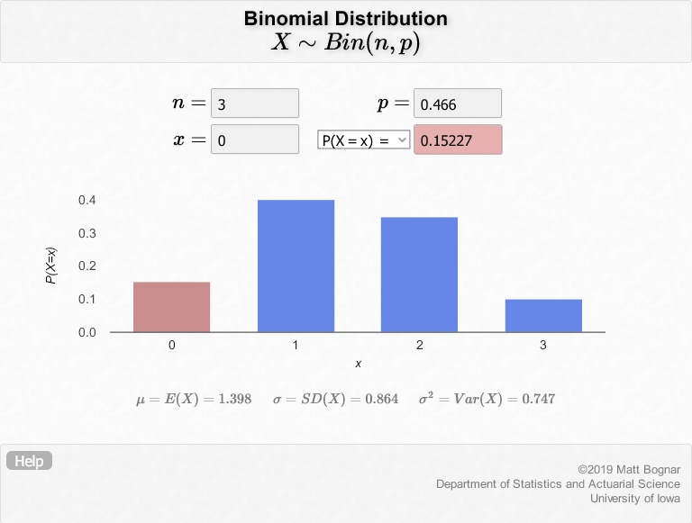{width=85%}

&nbsp;

Therefore the values are:

```{r table21, echo = FALSE}
table21 <- as.data.frame(c(0, 1, 2, 3))
table21$prob <- c(0.153, 0.348, 0.399, 0.101)
colnames(table21) <- c("Number of vaccine hesitant (x)", "P(X = x) = Probability of x vaccine hesitant")
kable(table21, booktabs = "T") %>% kable_styling(latex_options = "hold_position")
```

Notice how these values correspond to the bars of each of the applet screenshots. Try hovering over the bars.

&nbsp;

**For questions 9 and 10, use the applet. Approximate to the nearest thousandths**

**9. Now let's assume we are randomly selecting 10. What is the probability that 5 of them are going to be vaccine hesitant?**

The probability is 0.240.

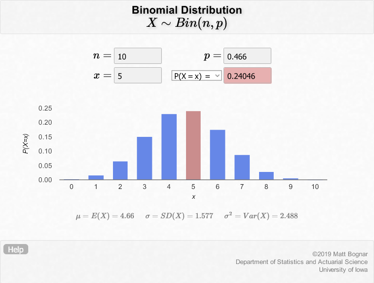{width=85%}

&nbsp;

**10. Now let's assume we are randomly selecting 100. What is the probability that 50 of them are going to be vaccine hesitant? What do you notice about the binomial distribution as n becomes larger and larger?**

The probability is 0.063. As n becomes larger, the binomial distribution resembles a normal distribution.

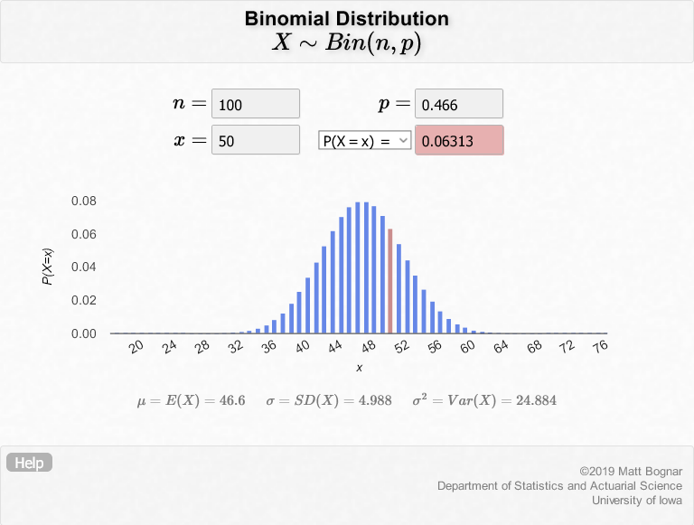{width=85%}

&nbsp;

&nbsp;


**PART B. Normal Distribution**

In the same survey, individuals were asked about their perceptions of how other people will accept the COVID-19 vaccine, as a measurement of vaccine norms. They were asked, "Out of 100 people in your community, how many do you think would take a COVID-19 vaccine if it were made available?" We will call this variable **vaccine norms.** While this is technically a discrete variable, we will assume for the purposes of this class that this is a continuous variable.

In the latest survey wave, conducted March 14 to 28, 2021, the mean vaccine norm was 60.7 for the Philippines. We will assume that the population distribution is normal. We will also assume 60.7 is the true population distribution $\mu$. We will also assume that the true population standard deviation $\sigma$ is 12.5.

To answer the following questions, either calculate these by hand using a calculator or use the University of Iowa Normal Distribution Applet [(https://homepage.divms.uiowa.edu/~mbognar/applets/normal.html)](https://homepage.divms.uiowa.edu/~mbognar/applets/normal.html). Approximate your answers to the nearest thousandth. 

&nbsp;

**1. Approximately the middle 68% of Filipinos have vaccine norms of what range of values?**

The question is asking for values approximately 1 standard deviation away from the mean or *z* = 1. Therefore, the range of values are from (60.7 - 12.5) to (60.7 + 12.5) = 48.2 to 73.2.

You may also use the applet to confirm these results.

Based on the values given, $\mu$ = 60.7, $\sigma$ = 12.5. Using the applet, we need to calculate the $P(X > x)$ values we need to get the corresponding $x$, which will define the upper and lower limits of the range of values. From the figure of the standard normal distribution below, This means that we need to get $P(X > x)$ = 0.16 and $P(X > x)$ = 0.16 + 0.34 + 0.34 = 0.84.

```{r normdist1, echo = FALSE}
# Code from https://mattmazur.com/2014/10/25/plotting-a-normal-distribution-with-r/
par(family = "Lato")

population_mean <- 0
population_sd <- 1
sd_to_fill <- 1
lower_bound <- population_mean - population_sd * sd_to_fill
upper_bound <- population_mean + population_sd * sd_to_fill
 
# Generates equally spaced values within 4 standard deviations of the mean
# This is used to connect the points on the curve so the more points the better
x <- seq(-4, 4, length = 1000) * population_sd + population_mean
 
# Returns the height of the probably distribution at each of those points
y <- dnorm(x, population_mean, population_sd)
 
# Generate the plot, where:
# - type: the type of plot to be drawn where "n" means do not plot the points
# - xlab: the title of the x axis
# - ylab: the title of the y axis
# - main: the overall title for the plot
# - axes: when false it suppresses the axis automatically generated by the high level plotting function so that we can create custom axis
plot(x, y, type="n", xlab = "Number of standard deviations", ylab = "", main = "Standard Normal Distribution", axes = FALSE, lwd = 3)
 
# Connect all of the points with each other to form the bell curve
lines(x, y)
 
# Returns a vector of boolean values representing whether the x value is between the two bounds then
# filters the values so that only the ones within the bounds are returned
bounds_filter <- x >= lower_bound & x <= upper_bound
x_within_bounds <- x[bounds_filter]
y_within_bounds <- y[bounds_filter]
 
# We want the filled in area to extend all the way down to the y axis which is why these two lines are necessary
# It makes the first point in the polygon (lower_bound, 0) and the last point (upper_bound, 0)
x_polygon <- c(lower_bound, x_within_bounds, upper_bound)
y_polygon <- c(0, y_within_bounds, 0)
 
polygon(x_polygon, y_polygon, col = "lightblue")
 
# Now determine the probability that someone falls between the two bounds so we can display it above the curve
# Remember that pnorm returns the probability that a normally distributed random number will be less than the given number
probability_within_bounds <- pnorm(upper_bound, population_mean, population_sd) - pnorm(lower_bound, population_mean, population_sd)
 
# Concatenate the various values so we can display it on the curve
text <- paste("P(", lower_bound, "< x <", upper_bound, ") =", signif(probability_within_bounds, digits = 2))
 
# Display the text on the plot. The default "side" parameter is 3, representing the top of the plot.
mtext(text, line = -1, at = 2)
 
# Add an axis to the current plot, where:
# - side: which side of the plot the axis should be drawn on where 1 represents the bottom
# - at: the points at which the tick-marks are to be drawn
# - pos: the coordinate at which the axis line is to be drawn
sd_axis_bounds = 5
axis_bounds <- seq(-sd_axis_bounds * population_sd + population_mean, sd_axis_bounds * population_sd + population_mean, by = population_sd)
axis(side = 1, at = axis_bounds, pos = 0)

# Add ablinesg
abline(v = population_mean)

# Add text
mtext("0.16", line = -12, at = -1.5)
mtext("0.16", line = -12, at = 1.5)
mtext("0.34", line = -12, at = -0.5)
mtext("0.34", line = -12, at = 0.5)
```

Plugging in these values using the applet:

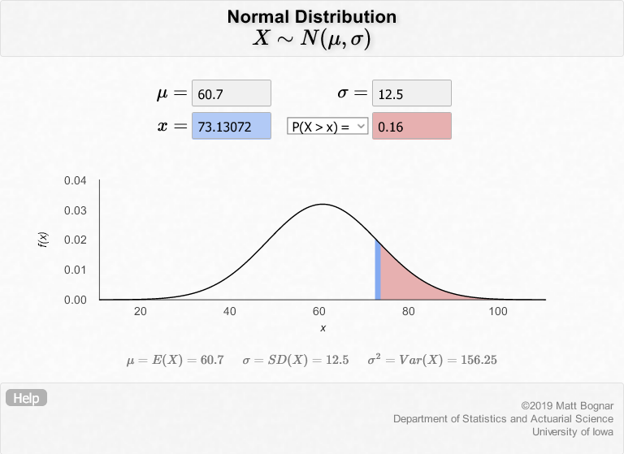{width=80%}

&nbsp;

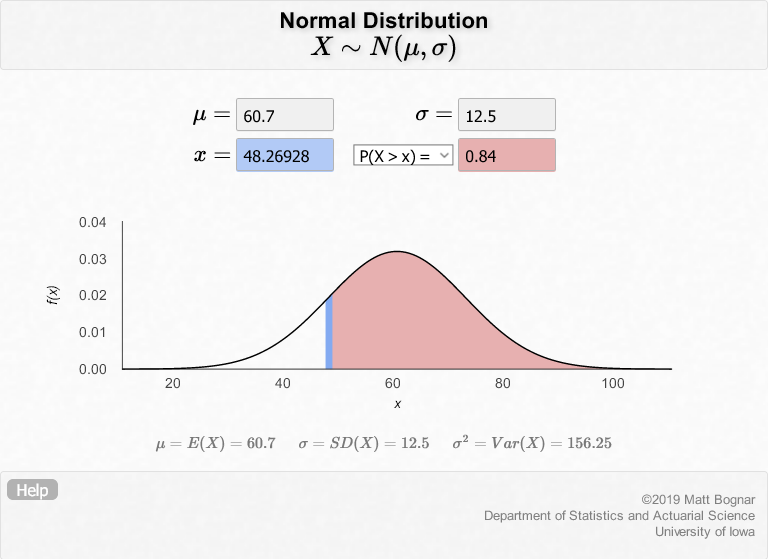{width=80%}

Take a moment to absorb how the P(X > x) value works in the applet.

&nbsp;

**2. Approximately the middle 95% of Filipinos have vaccine norms of what range of values?**

Based on the values given, $\mu$ = 60.7, $\sigma$ = 12.5. The question is asking for values approximately 2 standard deviations away from the mean or *z* = 2. Therefore, the range of values are from (60.7 - 12.5 * 2) to (60.7 + 12.5 * 2) = 35.7 to 85.7.

You may also use the applet to confirm these results.

Based on the values given, $\mu$ = 60.7, $\sigma$ = 12.5. Using the applet, we need to calculate the $P(X > x)$ values we need to get the corresponding $x$, which will define the upper and lower limits of the range of values. From the figure of the standard normal distribution below, This means that we need to get $P(X > x)$ = 0.025 and $P(X > x)$ = 0.025 + 0.475 + 0.475 = 0.975.

```{r normdist2, echo = FALSE}
# Code from https://mattmazur.com/2014/10/25/plotting-a-normal-distribution-with-r/
par(family = "Lato")

population_mean <- 0
population_sd <- 1
sd_to_fill <- 2
lower_bound <- population_mean - population_sd * sd_to_fill
upper_bound <- population_mean + population_sd * sd_to_fill
 
# Generates equally spaced values within 4 standard deviations of the mean
# This is used to connect the points on the curve so the more points the better
x <- seq(-4, 4, length = 1000) * population_sd + population_mean
 
# Returns the height of the probably distribution at each of those points
y <- dnorm(x, population_mean, population_sd)
 
# Generate the plot, where:
# - type: the type of plot to be drawn where "n" means do not plot the points
# - xlab: the title of the x axis
# - ylab: the title of the y axis
# - main: the overall title for the plot
# - axes: when false it suppresses the axis automatically generated by the high level plotting function so that we can create custom axis
plot(x, y, type="n", xlab = "Number of standard deviations", ylab = "", main = "Standard Normal Distribution", axes = FALSE, lwd = 3)
 
# Connect all of the points with each other to form the bell curve
lines(x, y)
 
# Returns a vector of boolean values representing whether the x value is between the two bounds then
# filters the values so that only the ones within the bounds are returned
bounds_filter <- x >= lower_bound & x <= upper_bound
x_within_bounds <- x[bounds_filter]
y_within_bounds <- y[bounds_filter]
 
# We want the filled in area to extend all the way down to the y axis which is why these two lines are necessary
# It makes the first point in the polygon (lower_bound, 0) and the last point (upper_bound, 0)
x_polygon <- c(lower_bound, x_within_bounds, upper_bound)
y_polygon <- c(0, y_within_bounds, 0)
 
polygon(x_polygon, y_polygon, col = "lightblue")
 
# Now determine the probability that someone falls between the two bounds so we can display it above the curve
# Remember that pnorm returns the probability that a normally distributed random number will be less than the given number
probability_within_bounds <- pnorm(upper_bound, population_mean, population_sd) - pnorm(lower_bound, population_mean, population_sd)
 
# Concatenate the various values so we can display it on the curve
text <- paste("P(", lower_bound, "< x <", upper_bound, ") =", signif(probability_within_bounds, digits = 2))
 
# Display the text on the plot. The default "side" parameter is 3, representing the top of the plot.
mtext(text, line = -1, at = 2)
 
# Add an axis to the current plot, where:
# - side: which side of the plot the axis should be drawn on where 1 represents the bottom
# - at: the points at which the tick-marks are to be drawn
# - pos: the coordinate at which the axis line is to be drawn
sd_axis_bounds = 5
axis_bounds <- seq(-sd_axis_bounds * population_sd + population_mean, sd_axis_bounds * population_sd + population_mean, by = population_sd)
axis(side = 1, at = axis_bounds, pos = 0)

# Add ablinesg
abline(v = population_mean)

# Add text
mtext("0.025", line = -12, at = -2.75)
mtext("0.025", line = -12, at = 2.75)
mtext("0.475", line = -12, at = -1)
mtext("0.475", line = -12, at = 1)
```

Plugging in these values using the applet:

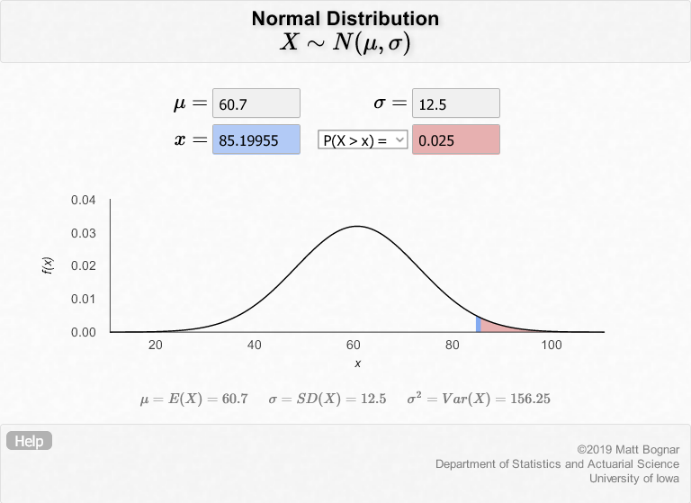{width=80%}

&nbsp;

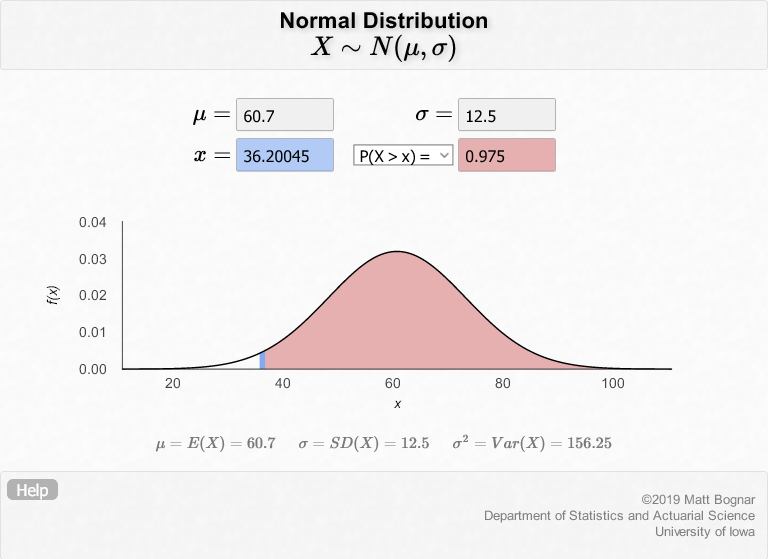{width=80%}

Note that the values in the applet and we calculated by hand are slightly different because we rounded off the *z* value to 2. To be more exact, the corresponding *z* for 95% probability is 1.96. Therefore, the range of values are from (60.7 - 12.5 * 1.96) to (60.7 + 12.5 * 1.96) = 36.2 to 85.2, which is the same as the applet.

&nbsp;

**3. Approximately the middle 80% of Filipinos have vaccine norms of what range of values?**

Using the applet, set $P(X > x)$ to 0.9 then 0.1. The range of values is 44.7 to 76.7  

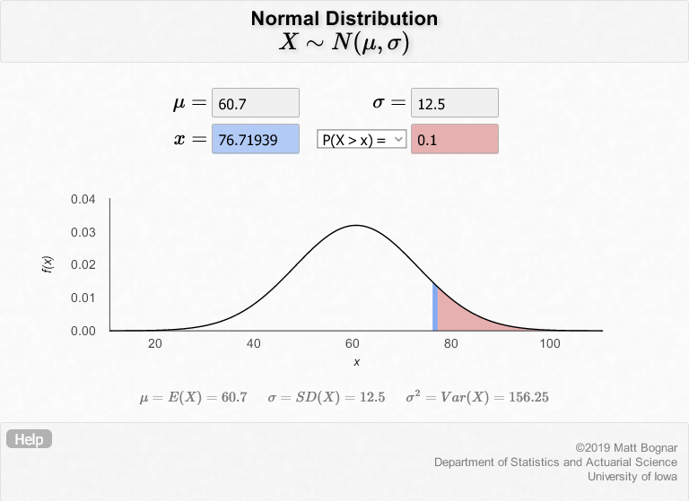{width=80%}

&nbsp;

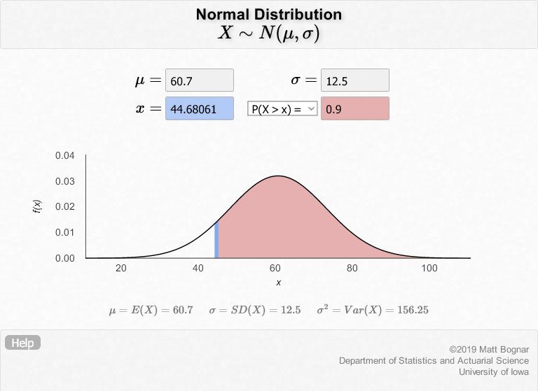{width=80%}

&nbsp;

**4. How many percent of Filipinos have vaccine norms above 50?**

Using the applet, set *x* = 50. The probability is 0.804

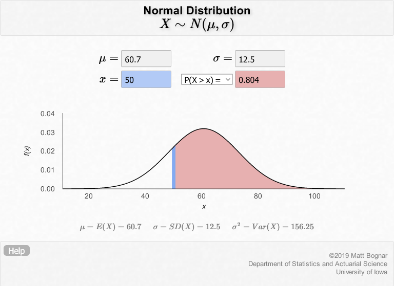{width=85%}

&nbsp;

**5. How many percent of Filipinos have vaccine norms between 35 and 55?**

Change the setting of the applet from $P(X > x)$ to $P(X < x)$ since we need to subtract the values of two areas: $P(X < 55)$ and $P(X < 35)$. Set *x* = 55 then *x* = 35, then subtract the probabilities.

$P(35 < X < 55) = P(X < 55) - P(X < 35) = 0.32419 - 0.01989 = 0.3043$

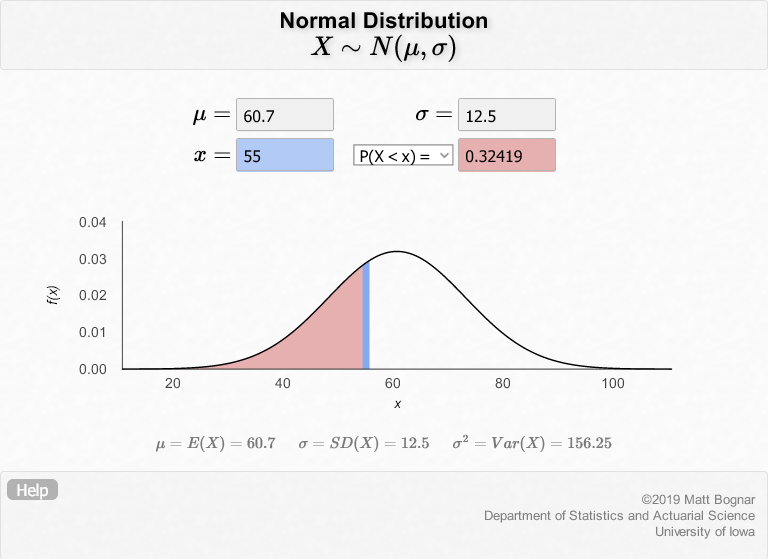{width=75%}

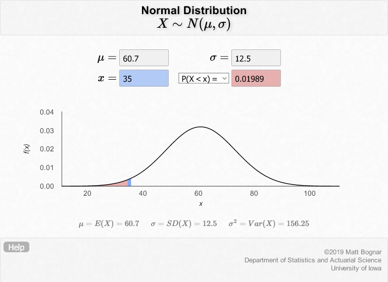{width=75%}

\center END OF LAB \center
