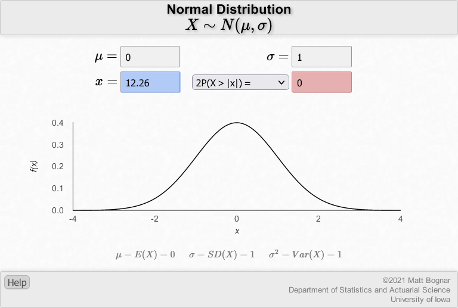
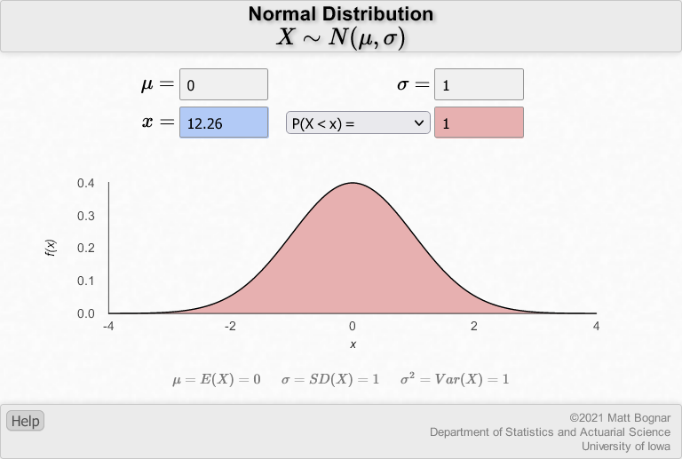
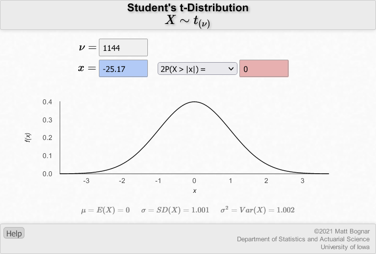
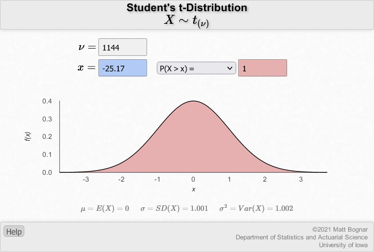

```{r setup, include = FALSE}
knitr::opts_chunk$set(echo = TRUE, dev="cairo_pdf")
```

```{r libraries, include = FALSE}
library(tidyverse)
library(knitr)
library(sysfonts)
library(kableExtra)
windowsFonts("Lato" = windowsFont("Lato"))
```

**INSTRUCTIONS**

The data set that we will be using for the entire course is resampled data from the MIT COVID-19 Beliefs, Behaviors & Norms Survey (https://covidsurvey.mit.edu/api.html). This is a multi-country, online survey that examined different COVID-19 perceptions across time, from July 6, 2020 to March 28, 2021. We will be using data from the Philippines aged 20 to 60.

In this lab, you will practice calculating confidence intervals and conducting hypothesis tests for one-sample proportions and means.

You have many options to submit this worksheet. Either you work on this by hand and scan/take a clear photo of your submission and save as PDF, or type your responses in a Word processor or PowerPoint presentation. You do not have to copy the questions again, but please number them accordingly.

```{r read_data, include = FALSE}
data <- read.csv("C:/Users/neljasonhaw/Google Drive (nhaw@ateneo.edu)/HSCI 50 SY 2021-2022/Labs/vax_accept_dummydata.csv")
```

&nbsp;

**Part A. One Sample Proportions**
The Philippine government has a target vaccination rate of 70% of the population. This means that the government can only afford to have at most 30% of the population who are hesitant of taking the COVID-19 vaccine. The government decides to conduct a survey of 1,145 individuals to check on the situation.

**1. Show that the sampling distribution of the sample proportion $\hat{p}$ approximates a normal distribution.**

Following the rule of thumb $np > 5$ and $nq > 5$, $n$ = 1145, $p$ = 0.30, $q = 1-p$ = 0.70, therefore 

$np = (1145)(0.30) = 343.5 > 5$ and $n(1-p) = (1145)(0.7) = 801.5 > 5$


**Now, the government received the results of the survey and the results are summarized below. Note that we are using the same table as in Lab 3.**

```{r table1, echo = FALSE, message = FALSE}
data <- data %>% mutate(hesitant = case_when(response == "Yes" | response == "Vaccinated" ~ "No",
                                             response == "No" | response == "Don't Know" ~ "Yes"))
table1 <- data %>% filter(wave == 19) %>% group_by(hesitant) %>% summarize(n=n(), p=round(n()/1145,3)*100)
colnames(table1) <- c("Vaccine hesitant", "Count", "Percent")
kable(table1, booktab = "T", caption = "COVID-19 vaccine hesitancy in the Philippines, March 14-28, 2021") %>%
  kable_styling(latex_options = "hold_position")
```


**2. What is the mean and the variance of the sampling distribution of the sample proportion $\hat{p}$?**

Given: $\hat{p}$ = 0.466, $\hat{q} = 1-\hat{p}$ = 0.534

**Review the lecture: There are two different kinds of distributions we have discussed so far: the distribution of our sample (the observed data) and the sampling distribution, of which our sample is just one of many possible samples in the sampling distribution.**

The mean of the sampling distribution of the sample proportion is estimated by the sample proportion $\hat{p}$

Mean: $\mu_{\hat{p}} = \hat{p} = 0.466$

The variance of the sampling distribution of the sample proportion is also the square of the standard deviation of the sampling distribution of the sample proportion - in other words, this is the square of the standard error. The variance of our sample, $\sigma^2$, which is the square of the standard deviation, $\sigma$, is different from the variance of the sampling distribution of the sample proportion, $\sigma^2_{\hat{p}}$, which is the square of the standard error $\sigma_{\hat{p}}$.

Variance: 
$$\sigma^2_{\hat{p}} = \frac{\hat{p}\hat{q}}{n} = \frac{0.466\times0.534}{1145} = 0.0002173$$

&nbsp;


**3. Now, we want to test whether the sample proportion $\hat{p}$ is different from the target of 30%. What is the null and alternative hypothesis? Calculate the *z*-statistic and the corresponding two-sided *p*-value. What is your conclusion based on the *p*-value and $\alpha$ = 0.05? You may use the University of Iowa Normal Distribution Applet to calculate the *p*-value [(https://homepage.divms.uiowa.edu/~mbognar/applets/normal.html)](https://homepage.divms.uiowa.edu/~mbognar/applets/normal.html).**

The hypotheses are as follows:

* Null hypothesis: $H_0: p = 0.3$
* alternative hypothesis: $H_{\mathrm{a}}: p \neq 0.3$


The calculation of the *z*-statistic requires not only the null value $p_0$ = 0.3 but also the standard error (SE) based on the null value $p_0$. Calculating the SE:

$$\mathrm{SE}_{p_0} = \sqrt{\frac{p_0(1-p_0)}{n}} = \sqrt{\frac{0.3(0.7)}{1145}} = 0.01354 $$

the *z*-statistic is calculated by

$$z = \frac{\hat{p} - p_0}{\mathrm{SE}_{p_0}} = \frac{0.466 - 0.3}{0.01354} = 12.26$$

&nbsp;

Using the applet, we plug in the following values based on the standard normal distribution: $\mu$ = 0, $\sigma$ = 1, $x$ = 12.26 to get the *p*-value ($2P(X > \lvert{x}\rvert)$) of zero. The tails only asymptotically approach zero but because of rounding limitations in the applet, it comes out as zero. We can assign it some small value such as *p* < 0.0005. 

{width=60%}

&nbsp;

Since *p* < 0.05, we reject the null hypothesis and conclude that the sample proportion of vaccine hesitancy (46.6%) is significantly different from the government target of 30%.

&nbsp;

**4. Now, we want to be more specific with our hypothesis test and check whether the sample proportion $\hat{p}$ is *lower* than the target of 30%. What are your new hypotheses, the *z*-statistic, and corresponding one-sided *p*-value? Does your conclusion change?**

The hypotheses are as follows:

* Null hypothesis: $H_0: p \geq 0.3$
* alternative hypothesis: $H_{\mathrm{a}}: p < 0.3$

The *z*-statistic is the same, 12.26. Using the applet, getting the one-sided *p*-value means changing the setting from $2P(X > \lvert{x}\rvert)$ to $P(X < x)$ (A tip: follow the direction of the sign of the alternative hypothesis). The *p*-value is now some very large number close to one. The tails only asymptotically approach one but because of rounding limitations in the applet, it comes out as one. Since *p* > 0.05, we fail to reject the null and conclude that the sample proportion of vaccine hesitancy (46.6%) is equal or higher than the government target of 30%.

{width=75%}

A note: Notice how the sample proportion is very much far from the target - by about 16.6 percentage points. This should signal to you the expected results of the null hypothesis significance testing. 

&nbsp;

**5. Now, estimate the 95% confidence interval of the sample proportion. Compare the confidence interval to the government target of 30%. Is your conclusion consistent with your answers in Questions 3 and 4?**

Recall the formula for estimating the 95% confidence interval:

$$95 \mathrm{\% \ CI} = \hat{p} \pm z_{0.05/2} \sqrt{\frac{\hat{p}(1-\hat{p})}{n}}$$

Recall that $z_{0.05/2}$ = 1.96,

$$95 \mathrm{\% \ CI} = 0.466 \pm 1.96 \sqrt{\frac{0.466(0.534)}{1145}} = (0.437, 0.495)$$

The 95% CI is above 0.30, therefore our conclusions are the same.

\newpage

**PART B. One Sample Means**

Let us revisit the vaccine norms data from Lab 3. Remember that the survey had results of mean = 60.7 and standard deviation = 12.5. In Lab 3, we assumed this was the population mean and population standard deviation, respectively. This time around, we will assume them to be the sample mean and sample standard deviation on a total sample of 1,145 respondents sampled nationally using simple random sampling.

This time around, the government has set a target of a mean of 70 for vaccine norms. There is no target standard deviation.

&nbsp;

**1. If the objective is to estimate the current population mean vaccine norm, does it matter that the sample data is normally distributed?**

No, as long as the sample size *n* is large enough, the sampling distribution of the sample mean will be normally distributed according to the Central Limit Theorem.

&nbsp;

**2. Estimate the variance of the sampling distribution of the sample mean.**

Since the population variance $\sigma^2_{\bar{x}}$ is not given, we approximate the variance of the sampling distribution of the sample mean $s^2_{\bar{x}}$ using the sample variance $s$. Recall that variance is the square of the standard deviation.

$$\sigma^2_{\bar{x}} \approx s^2_{\bar{x}} = \frac{s^2}{n} = \frac{12.5^2}{1145} = 0.1365$$

&nbsp;

**3. Now, we want to test whether the sample mean $\bar{x}$ is different from the target of 70. What is the null and alternative hypothesis? Calculate the *t*-statistic and the corresponding two-sided *p*-value. What is your conclusion based on the *p*-value and $\alpha$ = 0.05? You may use the University of Iowa Student's t Distribution Applet to calculate the *p*-value [(https://homepage.divms.uiowa.edu/~mbognar/applets/t.html)](https://homepage.divms.uiowa.edu/~mbognar/applets/t.html).**

The hypotheses are as follows:

* Null hypothesis: $H_0: \mu = 70$
* alternative hypothesis: $H_{\mathrm{a}}: \mu \neq 70$

Using the values we have calculated from Question 2, and recall that standard error (SE) = $\sqrt{\sigma^2_{\bar{x}}}$ the *t*-statistic is calculated by

$$t = \frac{\bar{x} - \mu_0}{\mathrm{SE}} = \frac{60.7 - 70}{\sqrt{0.1365}} = -25.178$$

&nbsp; 

Using the applet, we plug in the following values based on the standard normal distribution: $df = \nu = n - 1$ = 1145 - 1 = 1144, $x$ = -25.17 to get the *p*-value ($2P(X > \lvert{x}\rvert)$) of <0.0005 - The applet will show a value of zero. The tails only asymptotically approach zero but because of rounding limitations in the applet, it comes out as zero.

{width=60%}

Since *p* < 0.05, we reject the null hypothesis and conclude that the sample mean vaccine norm (60.7) is significantly different from the government target of 70.

&nbsp;

**4. Now, we want to be more specific with our hypothesis test and check whether the sample mean $\bar{x}$ is *higher* than the target of 70. What are your new hypotheses, the *t*-statistic, and corresponding one-sided *p*-value? Does your conclusion change?**

The hypotheses are as follows:

* Null hypothesis: $H_0: \mu \leq 70$
* alternative hypothesis: $H_{\mathrm{a}}: \mu > 70$

The *t*-statistic is the same, -25.17. Using the applet, getting the one-sided *p*-value means changing the setting from $2P(X > \lvert{x}\rvert)$ to $P(X > x)$ (A tip: follow the direction of the sign of the alternative hypothesis). The *p*-value is now some very large number close to one. The tails only asymptotically approach one but because of rounding limitations in the applet, it comes out as one. Since *p* > 0.05, we fail to reject the null and conclude that the sample mean vaccine norm (60.7) is equal or lower than the government target of 70.

{width=60%}

A note: Notice how the sample proportion is very much far from the target - by about 9.9 percentage points. This should signal to you the expected results of the null hypothesis significance testing. 

&nbsp;

**5. Now, estimate the 95% confidence interval of the sample mean. Compare the confidence interval to the government target of 70. Is your conclusion consistent with your answers in Questions 3 and 4?**

Recall the formula for estimating the 95% confidence interval:

$$95 \mathrm{\% \ CI} = \bar{x} \pm t_{0.05/2, df} {s_{\bar{x}}}$$

Recall that $t_{0.05/2, 1144} \approx z_{0.05/2}$ = 1.96. For smaller df in future questions, use the applet.

$$95 \mathrm{\% \ CI} = 60.7 \pm 1.96 \sqrt{0.1365} = (60.0, 61.4)$$

The 95% CI is below 70, therefore our conclusions are the same.

&nbsp;

&nbsp;

\center END OF LAB \center