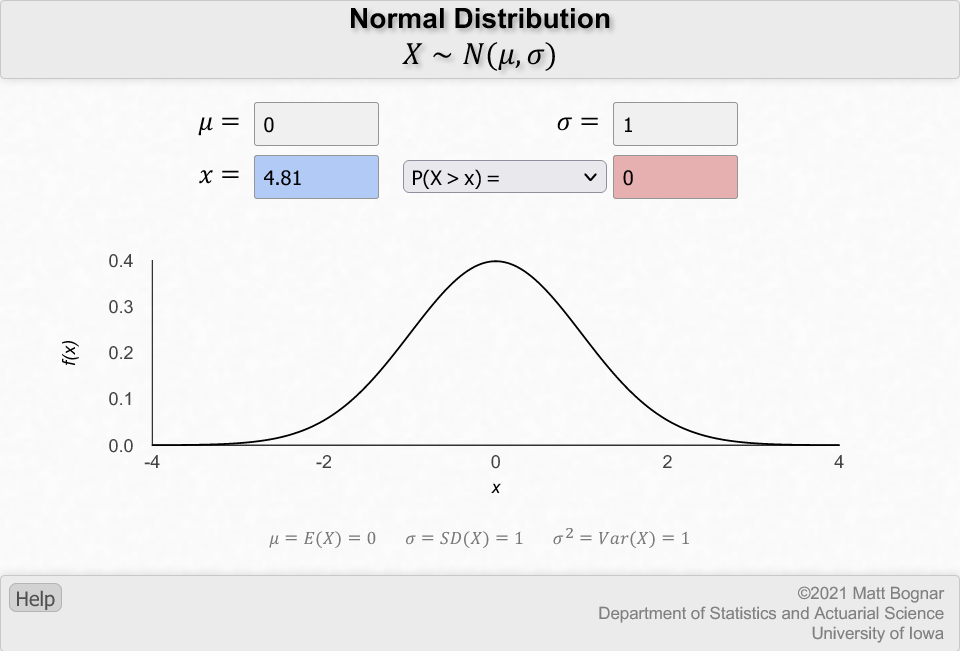
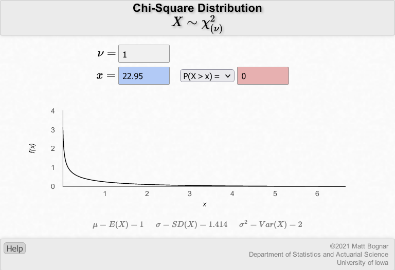

```{r setup, include = FALSE}
knitr::opts_chunk$set(echo = TRUE, dev="cairo_pdf")
```

```{r libraries, include = FALSE}
library(tidyverse)
library(knitr)
library(sysfonts)
library(kableExtra)
windowsFonts("Lato" = windowsFont("Lato"))
```

**INSTRUCTIONS**

The data set that we will be using for the entire course is resampled data from the MIT COVID-19 Beliefs, Behaviors & Norms Survey (https://covidsurvey.mit.edu/api.html). This is a multi-country, online survey that examined different COVID-19 perceptions across time, from July 6, 2020 to March 28, 2021. We will be using data from the Philippines aged 20 to 60.

In this lab, you will learn how to conduct the *z*-test for proportions and chi-square test of independent association of categorical variables.

You have many options to submit this worksheet. Either you work on this by hand and scan/take a clear photo of your submission and save as PDF, or type your responses in a Word processor or PowerPoint presentation. You do not have to copy the questions again, but please number them accordingly.

```{r read_data, include = FALSE}
data <- read.csv("C:/Users/neljasonhaw/Google Drive (nhaw@ateneo.edu)/HSCI 50 SY 2021-2022/Labs/vax_accept_dummydata.csv")
```

&nbsp;

&nbsp;

**Let us revisit a cross tabulation we had used in Lab 2 on COVID-19 vaccine acceptance and age group**
```{r table1, echo = FALSE, message = FALSE}
data$response <- factor(data$response, 
                        levels = c("Yes",  "No", "Don't Know", "Vaccinated"))
table1 <- data %>% filter(wave == 19) %>% group_by(age_grp, response) %>% summarize(n=n()) %>% spread(age_grp, n)
colnames(table1) <- c("Accept COVID-19 vaccine", "Aged 20-30", "Aged 31-40", "Aged 41-50", "Aged 51-60")
kable(table1, booktab = "T", caption = "COVID-19 vaccine acceptance in the Philippines by age, March 14-28, 2021") %>%
  kable_styling(latex_options = "hold_position")
```

&nbsp;

&nbsp;

**PART A. *Z*-test for proportions**

For this part, we will use a simplified table from Table 1. We will recode the vaccine acceptance variable into a binary category similar to Lab 3 called vaccine hesitancy, where those who do not accept the vaccine or are unsure about it will be considered vaccine hesitant, otherwise they are not vaccine hesitant. We will also recode the age group variable into younger adults, defined in this lab as aged 20 to 40, and older adults, defined in this lab as aged 41 to 60. The table below summarizes that information.


```{r table2, echo = FALSE, message = FALSE}
data <- data %>% mutate(hesitant = case_when(response == "Yes" | response == "Vaccinated" ~ "No",
                                             response == "No" | response == "Don't Know" ~ "Yes"))
data <- data %>% mutate(adult_bin = case_when(age_grp == "20-30" | age_grp == "31-40" ~ "20-40 y/o",
                                              age_grp == "41-50" | age_grp == "51-60" ~ "51-60 y/o"))
table2 <- data %>% filter(wave == 19) %>% group_by(adult_bin, hesitant) %>% summarize(n=n()) %>% spread(adult_bin, n)
colnames(table2) <- c("Vaccine hesitant", "Younger adult", "Older adult")
kable(table2, booktab = "T", caption = "COVID-19 vaccine hesitancy in the Philippines by age, March 14-28, 2021") %>%
  kable_styling(latex_options = "hold_position")
```

**1. Calculate the conditional probabilities of vaccine hesitancy by age, i.e. *P*(vaccine hesitant | younger adult) and *P*(vaccine hesitant | older adult)**

* *P*(vaccine hesitant | younger adult) = `r table2[2,2]` / `r table2[1,2] + table2[2,2]` = `r round(table2[2,2] /(table2[1,2] + table2[2,2]),2)`
* *P*(vaccine hesitant | older adult) = `r table2[2,3]` / `r table2[1,3] + table2[2,3]` = `r round(table2[2,3] /(table2[1,3] + table2[2,3]),2)`

&nbsp;

**2. To test for the differences in these two proportions, how would you phrase the null hypothesis for a z-test of two proportions? How about the alternative hypothesis?**

$$H_0: p_1 = p_2; H_{\mathrm{a}}: p_1 \neq p_2$$
or

$$H_0: p_0 = p_1 - p_2 = 0; H_{\mathrm{a}}: p_0 = p_1 - p_2 \neq 0$$

where $p_1$ and $p_2$ are the proportions of vaccine hesitancy for younger and older groups (doesn't matter what the order is, just make sure to keep track of the two when interpreting results)

&nbsp;

**3. Calculate by hand the test statistic for this test**

We need a *z*-statistic, and the test statistic is calculated a
$$ z = \frac{(\hat{p}_1 - \hat{p}_2)-p_0}{\rm{SE}} $$

where $\hat{p}_{\rm{pooled}}$ is the pooled proportion 
$$ \hat{p}_{\rm{pooled}} = \frac{\hat{p}_1n_1+\hat{p}_2n_2}{n_1+n_2} $$

and SE is the standard error

$$ \mathrm{SE} = \sqrt{\frac{\hat{p}_{\mathrm{pooled}} (1 - \hat{p}_{\mathrm{pooled}} ) }{n_1} + \frac{\hat{p}_{\mathrm{pooled}} (1 - \hat{p}_{\mathrm{pooled}} ) }{n_2} } $$
where $\hat{p}_1$ and  $\hat{p}_2$ are the conditional probabilities for each group, and $n_1$ and $n_2$ are the number of individuals in each group (this is what was given in Question 1). $p_0 = 0$ from Question 2.

Filling in the given values to calculate $\hat{p}_{\rm{pooled}}$
$$ \hat{p}_{\rm{pooled}} = \frac{\hat{p}_1n_1+\hat{p}_2n_2}{n_1+n_2} = \frac{(0.52)(760)+(0.37)(385)}{760+385}=0.47$$
&nbsp;

Filling in the given values to calculate $\rm{SE}$
$$ \mathrm{SE} = \sqrt{\frac{\hat{p}_{\mathrm{pooled}} (1 - \hat{p}_{\mathrm{pooled}} ) }{n_1} + \frac{\hat{p}_{\mathrm{pooled}} (1 - \hat{p}_{\mathrm{pooled}} ) }{n_2} } = \sqrt{\frac{0.47(1-0.47)}{760} + \frac{(0.47)(1-0.47)}{385}} = 0.0312$$
Filling in the values to calculate the *z*-statistic:
$$ z = \frac{(\hat{p}_1 - \hat{p}_2)-p_0}{\rm{SE}} = \frac{0.15-0}{0.0312} = 4.81$$
Therefore the z-statistic = 4.81 

&nbsp;

**4. Calculate the corresponding *p*-value from the test statistic calculated in Question 3 Using the University of Iowa Normal Distribution Applet [(https://homepage.divms.uiowa.edu/~mbognar/applets/normal.html)](https://homepage.divms.uiowa.edu/~mbognar/applets/normal.html)**

Note: Matching the variables in the applet and the variables in our lab worksheet: $\mu = p_0$, $\sigma = \rm{SE}$ $x = z$. Select the 2-sided *p*-value option: 2P(X > |x|)

Plugging in these values using the applet:

{width=80%}

The *p*-value is very small. The applet shows this as zero, but remember that the *p*-value only asymptotically reaches zero, so we can assign a very low number instead like *p* < 0.0005.

&nbsp;

**5. What do you conclude?**

Because *p* < 0.05, we reject the null hypothesis and conclude that the proportion of vaccine hesitancy between the younger and older age groups are different. Specifically, the vaccine hesitancy among older age groups (41 - 60 years old) is lower at 37% as compared to younger age groups (21 - 40 years old) at 52%.

&nbsp;  

**6. Calculate the 95% confidence interval of the difference of the two proportions. Do you arrive at the same conclusions as the hypothesis test? How?**

The 95% confidence interval is $\hat{p}_1-\hat{p}_2 \pm z_{\alpha/2}*\rm{SE}$ where $z_{\alpha/2}$ = 1.96 when $\alpha = 0.05$.

Plugging in the values: $0.52 - 0.37 \pm 1.96(0.0312) = (0.09, 0.21)$

Therefore, the 95% CI on the point estimate of the difference of 0.15 is (0.09, 0.21). We arrive at the same conclusion as the hypothesis test because the 95% CI does not cross the null value of 0.

&nbsp;

Quick note: Notice how the point estimate of the proportions themselves are far apart (a 15 percentage point spread!), enough for us to worry about higher vaccine hesitancy rates among younger populations regardless of what the statistical tests are telling us.

&nbsp;

**PART B. Chi-square test of independence of associations**

**1. We will first use the same 2x2 table from Part A to practice calculating expected counts by hand. Calculate the expected counts of each of the cells of Table 2.**

Recall that the formula for expected counts is:
$$\rm{Expected \ Count}_{row \ i, \ column \ j} = \rm{\frac{row \ i \ total \times column \ j \ total}{table \ total}}  $$

The given totals from Table 2 are as follows:

* Not vaccine hesitant - row total: 368 + 244 = 612
* Vaccine hesitant - row total: 392 + 141 = 533
* Younger adult - column total: 368 + 392 = 760
* Older adult - column total: 244 + 141 = 385
* Total = 368 + 392 + 244 + 141 = 1145


Calculating the expected totals for each of the cells in Table 2:


$$\rm{Expected \ Count}_{not \ hesitant, \ younger \ adult} = \frac{612 \times 760}{1145} = 406.2$$

$$\rm{Expected \ Count}_{hesitant, \ younger \ adult} = \frac{533 \times 760}{1145} = 353.8$$

$$\rm{Expected \ Count}_{not \ hesitant, \ older \ adult} = \frac{612 \times 385}{1145} = 205.8$$

$$\rm{Expected \ Count}_{hesitant, \ older \ adult} = \frac{533 \times 385}{1145} = 179.2$$

The table of expected values should look something like this:
```{r table3, echo=FALSE}
table3 <- matrix(c("No", "Yes", 406.2, 353.8, 205.8, 179.2), nrow=2)
colnames(table3) <- c("Vaccine hesitant", "Younger adult", "Older adult")
kable(table3, booktab = "T", caption = "COVID-19 vaccine hesitancy by age, March 14-18, 2021, expected counts") %>%
  kable_styling(latex_options = "hold_position")

```

&nbsp;

**2. What is the null hypothesis appropriate for a chi-square test for independence of association? How about the alternative hypothesis?**

The null hypothesis is that vaccine hesitancy is not associated with age group (younger vs. older adult). The alternative hypothesis is that vaccine hesitancy is associated with age group (younger vs. older adult).

&nbsp;

**3. Calculate the chi-squared statistic by hand**

Recall that the chi-squared statistic is the sum of each individual squared differences of observed and expected counts divided by the expected count.

$$\chi^2 =  \rm{Summation \ of \ each \ cell's \ }\frac{(\rm{Expected \ count}- \rm{Observed \ count})^2}{Expected \ count} $$
We have four cells in the table, therefore:

$$\chi^2 = \frac{(406.2 - 368)^2}{406.2} + \frac{(353.8 - 392)^2}{353.8} + \frac{(205.8 - 244)^2}{205.8} + \frac{(179.2 - 141)^2}{179.2}= 22.95$$
Note that your answers may slightly differ based on rounding error, but your answer should be around this number give or take.

&nbsp;

**4. Calculate the corresponding *p*-value using the University of Iowa chi-square distribution applet [(https://homepage.divms.uiowa.edu/~mbognar/applets/chisq.html)](https://homepage.divms.uiowa.edu/~mbognar/applets/chisq.html)**

Note that in the applet, $\nu = \rm{degrees \ of \ freedom}$, $x = \chi_2 \rm{\ statistic}$, and multiply by 2 whatever output you see on *P*(*X* > *x*) to get the *p*-value

Recall that the degress of freedom for a chi-square test is: df = (rows - 1) x (columns - 1) = (2 - 1) x (2 - 1) = 1 x 1 = 1

Plugging in these values using the applet:

{width=80%}

The *p*-value is very small. The applet shows this as zero, but remember that the *p*-value only asymptotically reaches zero, so we can assign a very low number instead like *p* < 0.0005.

&nbsp;

**5. What do you conclude?**

Because *p* < 0.05, we reject the null hypothesis and conclude that there is an association betweeen vaccine hesitancy and age groups.

&nbsp;

**6. Compare your results and conclusion in Part A with what you have gotten so far in Part B. How does the *z*-test of proportions differ from the chi-square test of independence of association?**

The conclusion is the same that the vaccine hesitancy and age group are associated with one another. The difference between the two tests is that the *z*-test for proportions can give us a measure of how different the proportions in each of the groups are, but does not go beyond binary categories of either the independent or dependent variable. On the other hand, the chi-square test of independence of association can be extended to any number of categories for both independent and dependent variable but does not tell us of the magnitude of association between categories.

&nbsp;

**7. Finally, return to Table 1 and say you conducted a chi-square test of association using statistical software and you have gotten following statistical output result below**

```{r chisq1, echo = FALSE}
chisq.test(table1[,c(2,3,4,5)])
```

**Briefly report the appropriate null hypothesis, the chi-squared statistic, the *p*-value, and your conclusion.**

The null hypothesis is practically the same - there is no association between vaccine acceptance categories and age group. The only difference is that the age group is now a four-category variable instead of a binary variable. The chi-squared statistic is 46.53, with a corresponding *p*-value of *p* < 0.0005. Therefore, we reject the null hypothesis and conclude that there is an association between vaccine acceptance categories and age group.

&nbsp;

**8. Are you concerned that the analysis in number 7 met all the assumptions of a chi-squared test for independence of association? Justify.**

All the assumptions were met. Recall that the **EXPECTED** counts of each cell must be greater than or equal to 5, not that the **OBSERVED** counts must be greater than or equal to 5. We may be concerned about the cell Vaccinated-Aged 51-60 but we can calculate the expected count as follows:

$$\rm{Expected \ Count}_{vaccinated, \ aged \ 51-60} = \frac{(18+5+10+1) \times (110+26+32+1)}{1145} = 5.02$$

The expected count of the smallest observed cell is still greater than or equal to 5, therefore the assumptions were met.

\center END OF LAB \center
